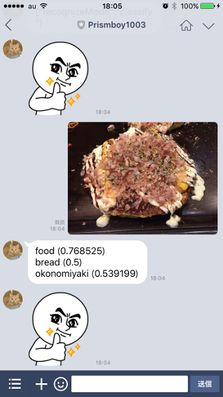
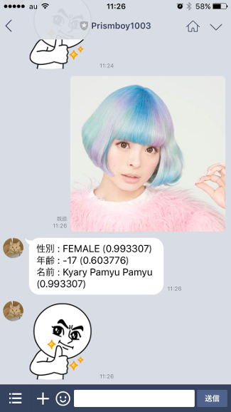
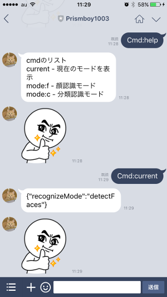
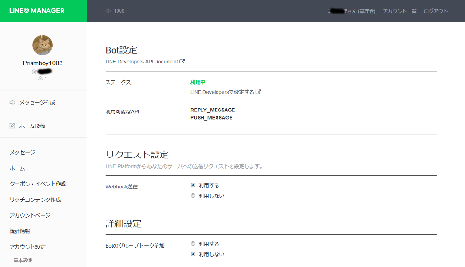
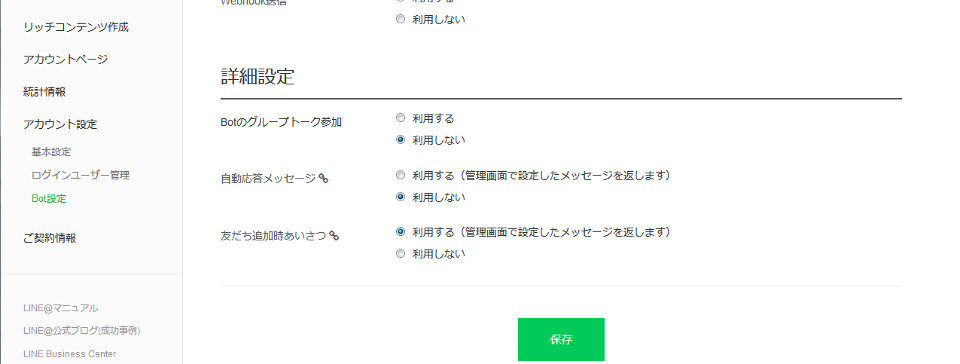
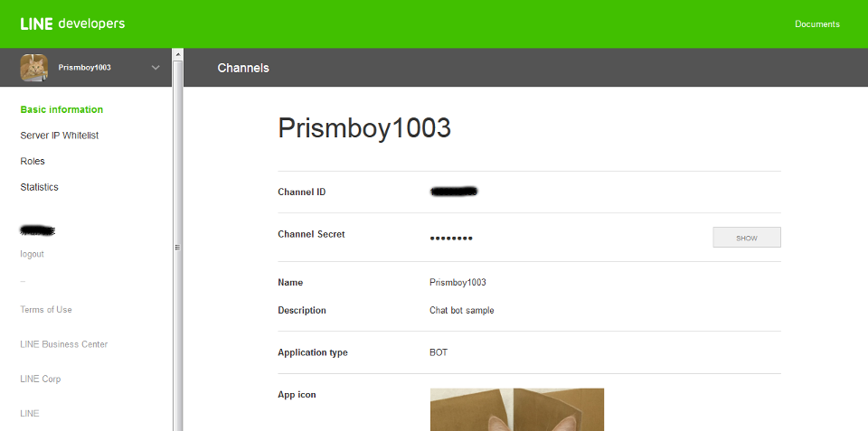
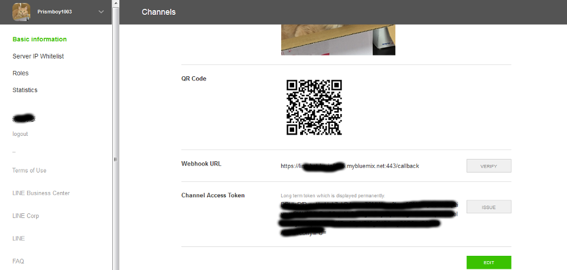
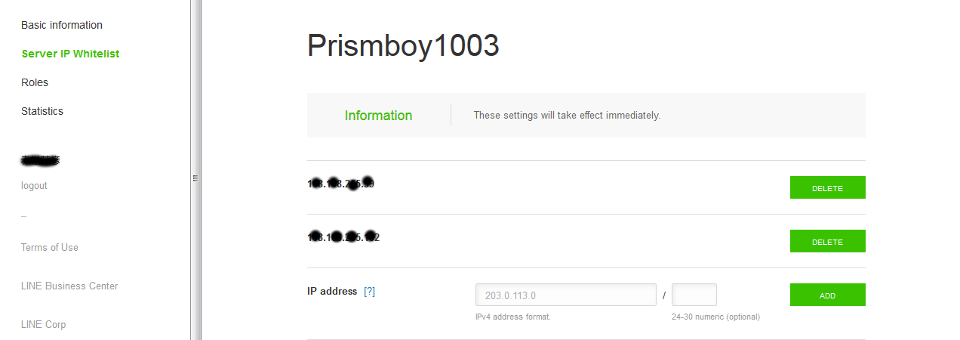
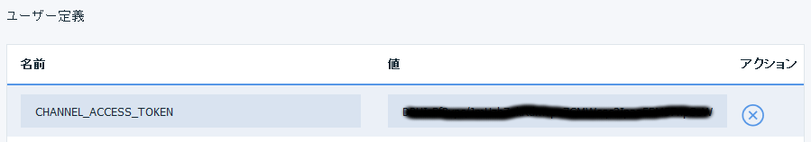

## (Message API対応版)
# LINE BOT - Watson Visual Recognition - Detect faces & Classify

## はじめに  
LINE に顔写真やモノの写真を送信することで、IBM Bluemix の Visual Recogniton で 顔写真やモノの写真を判定して結果 (JSON) を返す CF アプリを実装しました。

LINE BOT は Server IP Whitelist にコールバック・アプリケーションのIP アドレスを設定します。しかし、CFアプリの IP アドレスは起動毎に変わってしまい、固定にできません。そこで、次のサイトを参考に、Bluemix のサービス「Statica」(3rd party) を使用して Proxy を構成しました。 (師匠ありがとうございます。)  

- http://dotnsf.blog.jp/archives/2016-04-15.html

顔認識モードおよび分類認識はモードはcmd:modeコマンドにて切り替えます。
(大文字・小文字どちらでもOK)

|No.|モード|コマンド|備考|
|:--|:-----|:-------|:---|
|1|顔認識モード|cmd:mode:f||
|2| 分類認識モード|cmd:mode:c|(ランタイム起動時のデフォルト)|
|3|モード確認|cmd:current||
|4|ヘルプ|cmd:help||

## 使い方
LINE アプリの友だち追加で、以下の QR コードを読み込ませてください。  

  

実行結果を以下に示します。

|分類認識モード|顔認識モード|コマンド入力|
|:-------------|:-------------|:-------------|
||||  

## セットアップ  
1. 本サイトから line-bot アプリをダウンロード (Download ZIP) して解凍してください。ディレクトリ名は line-bot-sample-master から line-bot-sample に変更してください。

1. Bluemix コンソールから CFアプリケーション (Node.js) を作成してください。以下の sample はご自身のユーザ名などに変更してください。  
アプリケーション名: line-bot-[yourname] (任意)  

    > 以降、line-bot-foobar で説明します。

1. CF コマンド・ライン・インターフェースをインストールしていない場合は、インストールしてください。

1. Statica を作成し、line-bot-foobar にバインドしてください。  
サービス名: line-bot-statica (任意)  

1. Visual Recognition を作成し、line-bot-foobar にバインドしてください。  
サービス名: line-bot-visual-recognition (任意)  

1. 以下のサイトから、Developer Trial Account を登録してください。  
https://business.line.me/

1. LINE@MANAGERを以下に示します。

(続き)

1. LINE Developers Basic Information を以下に示します。

(続き)

1. LINE Developers Server IP Whitelist は、Statica Dashboard の Setup に示されている Your Static IPs を登録してください。
  

1. Bluemix コンソールから CF アプリの環境変数 (ユーザー定義) を設定します。LINE BOT Basic Information に従って設定してください。
    - CHANNEL_ACCESS_TOKEN : Channel Access Token
      

1. 解凍したディレクトリ (line-bot アプリのホーム) に移動してください。

        > cd line-bot-sample

1. manifest.ymlを編集して、『applications』以下にある『name』および『host』にアプリケーション名(line-bot-foobar)を指定してください。

1. Bluemixに接続してください。

        > cf api https://api.ng.bluemix.net
    

1. Bluemix にログインしてください。

        > cf login -u hogehoge@foo.bar.com -o hogehoge@foo.bar.com -s dev

1. アプリをデプロイしてください。

        > cf push line-bot-foobar

## アプリの構成

[LINE]<-->[LINE BOT]<-->[Bluemix Statica]<-->[Bluemix Node.js]<-->[Bluemix Visual Recognition]

## ファイル構成  
    line-bot
    │  .cfignore
    │  .gitignore
    │  app.js                 LINE BOT アプリ
    │  package.json
    │  README.md
    │  
    ├─docs
    │      env.png                readme.md の図: 環境変数 (ユーザー定義)
    │      line-at-manager1.png   readme.md の図: LINE@MANAGER
    │      line-at-manager2.png   readme.md の図: LINE@MANAGER (続き)
    │      line-basic1.png        readme.md の図: LINE Base Information
    │      line-basic2.png        readme.md の図: LINE Base Information (続き)
    │      line-whitelist.png     readme.md の図: LINE Server IP Whitelist
    │      qr.png                 readme.md の図: QR Code
    │      result-classify.png    readme.md の図: 分類認識実行結果
    │      result-detectface.png  readme.md の図: 顔認識実行結果
    │      result-command.png     readme.md の図: コマンド実行結果
    │      
    ├─routes
    │      index.js           LINE BOT アプリのルーティング
    │      
    └─utils
           context.js         LINE BOT アプリのコンテキスト

## ルート (URLマッピング)  
|Action|Method|処理|
|---|-----------|-----------|
|/callback|POST|LINE から呼び出されるコールバック。LINEに画像を送信した場合、Visual Recognition の Detect Face を呼出し結果 (JSON) を返す。画像以外の場合は、「顔写真を送ってください。」と返答する。|

## まとめ (・・・というかハマった箇所)
- LINE との接続には Request モジュールを使用しました。イメージを取得する際 (LINE Getting Message Content) は {encoding: null} を指定しないと正しいデータが取得できません。 (デフォルト utf-8変換されるため。)
- Visual Recognition は直接バイナリデータを扱えません。LINE から取得したイメージ (バイナリ) は一旦 Bluemix 環境に保存して、その時のファイル名からリードストリームを作成してVisual Recognition に渡しています。LINE BOT との連携は向いてないと思いました。 
